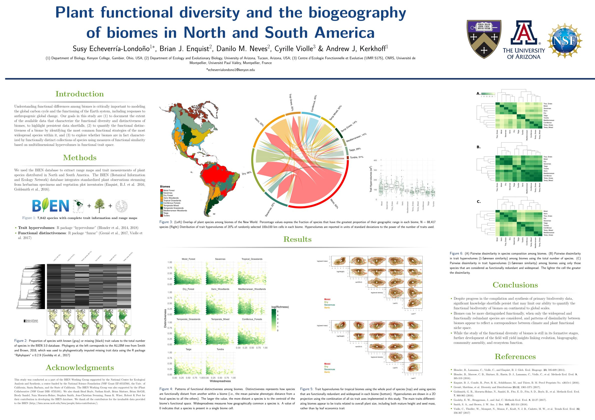

# Plant functional diversity and the biogeography of biomes in North and South America (POSTER)

The Latex code was modified from the Latex poster template from Nathaniel Johnston found [here](http://www.nathanieljohnston.com/2009/08/latex-poster-template/)

The original publication can be found in https://doi.org/10.3389/fevo.2018.00219

Presented at the Botany 2018 conference (Rochester, MN, US) and the Three Rivers Evolution event (Pittsburgh, PA, US).
